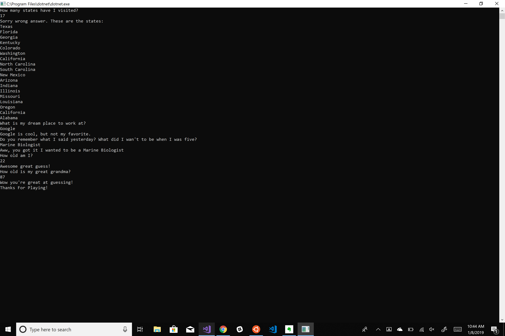

# Lab-01-AboutMeQuiz
The purpose of this console application is to demonstrate basic C# skills. This program is a Quiz about myself(the author), I have designed 5 questions that a user is able to answer.

## Application View

## Getting Started 
To view this program, fork or clone it into Visual Studio and then click the green start button.

## Contributing
As I use this for my own projects, I know this might not be the perfect approach for all the projects out there. If you have any ideas, just open an issue and tell me what you think.

If you'd like to contribute, please fork the repository and make changes as you'd like. Pull requests are warmly welcome.

## Licensing
This project is licensed under MIT License. 

